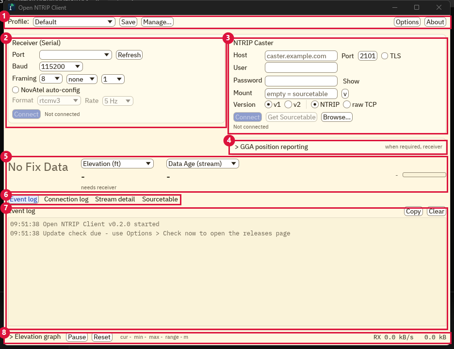

# Open NTRIP Client

A free, open-source diagnostic client for NTRIP / RTK correction streams. One portable
executable, no installer: drop it in a folder, connect to a caster, and see exactly what is
happening on the wire - credentials, mountpoints, sourcetables, RTCM message flow, and the
NMEA position handshake.

It is a clean-room successor to the
[Lefebure NTRIP Client](https://lefebure.com/software/ntripclient/): the same job (verify a
caster is up, credentials work, a mountpoint streams, and geofencing accepts your position),
rebuilt in Rust with the whole protocol conversation on one screen. No code was reused.

**Status: 0.2.0, pre-release (pre-1.0).**

## Features

- NTRIP v1 and v2 (HTTP/1.1, chunked transfer) plus raw TCP straight to the byte stream.
- TLS with the bundled root store, and a loud diagnostic-only override for self-signed casters.
- Serial receiver forwarding over any COM port, with NovAtel auto-configuration.
- GGA position reporting for VRS and geofenced mounts, with an offline embedded city / ZIP geocoder.
- Four always-present diagnostic tabs - Event log, Connection log, RTCM3 Stream detail, and Sourcetable browser.
- Live RTCM3 inspector: per-message-type counts, rates, sizes, CRC and garbage-byte health.
- Sourcetable browser with STR / CAS / NET records, sorting, filtering, and one-click mount select.
- Live readouts (fix state, correction age, DOPs, satellites, speed) plus a stream-activity indicator.
- Event, NMEA, and raw-capture logging, all next to the exe.
- Portable single exe - no installer, no AppData, no registry.
- Headless `--selftest` for scripting and CI.

## Download and install

Releases are built by the tag-triggered CI pipeline (`.github/workflows/release.yml`).
Grab the latest from the **releases page** of the repository:

- **Windows (primary):** `OpenNtripClient.exe` - one file, no installer, no DLLs. The
  published exe is code-signed; verify the digital-signature tab in file Properties and check
  `SHA256SUMS`. SmartScreen may still show "Windows protected your PC" while the signing
  certificate builds reputation - choose **More info -> Run anyway** after verifying the
  signature. Unsigned CI or self-built binaries always trigger SmartScreen; that is expected.
- **Linux / macOS:** `open-ntrip-client-<version>-linux-x86_64.tar.gz` and
  `open-ntrip-client-<version>-macos-arm64.tar.gz`.

The app is **portable by design**: it writes settings, logs, and captures only to the folder
it runs from - never AppData, never the registry. To move or back up an installation, copy
the folder.

## Quick start

1. Put `OpenNtripClient.exe` in a folder of its own (it writes its files there).
2. Coming from the Lefebure client? Copy your old `Settings.txt` / `ntripconfig.txt` into
   that folder first. The first run imports them into `settings.toml` and leaves the
   originals untouched.
3. In the **NTRIP Caster** panel, enter host / port / credentials, click **Get Sourcetable**,
   open the **Sourcetable** tab, pick a mountpoint, then click **Connect**.
4. Optional: in **Receiver (Serial)**, pick your GNSS receiver's COM port and baud to forward
   corrections and watch the fix state. If the caster wants a position from you (a geofenced
   or VRS mount), set it up under **GGA position reporting** (city / ZIP / lat-lon).

> Security note: caster passwords are stored in plaintext in `settings.toml`, exactly as the
> original stored them in `ntripconfig.txt` - the portable folder is the security boundary.
> Anyone who can read the folder can recover the credentials, so keep it off shared machines
> and shared drives if that matters for your caster account.

## The interface

The whole client is a single window. Every region, the GGA handshake, and the diagnostic
tabs are documented in the [user guide](docs/user-guide.md).



## Building from source

```
cargo build --release
```

The binary is `OpenNtripClient.exe` (Windows) or `OpenNtripClient` (elsewhere). The Rust
toolchain is pinned by `rust-toolchain.toml`. Linux needs
`libudev-dev pkg-config libxkbcommon-dev libwayland-dev libgl1-mesa-dev`.

If the repo lives on a network share, redirect the build directory to a local disk first -
builds on SMB are slow and flaky. Use a repo-local, machine-local config (it is gitignored)
so it applies to every shell and never leaks into your other cargo projects:

```
# .cargo/config.toml (create it in the repo root)
[build]
target-dir = "C:/cargo-target/open-ntrip-client"
```

The embedded geocoding database (`crates/geodb/data/geo.bin`) is committed, so a normal build
needs no downloads and works offline. To regenerate it from fresh GeoNames / US Census data,
see `tools/geodb-gen`.

Contributor docs live in `docs/`: `one-surface.md` (the UI layout law), `design-guide.md`
(the Butter Paper theme), `protocol-notes.md`, `parity-checklist.md`, and `signing.md`.

## Heritage and license

This project is a clean-room successor to the
[Lefebure NTRIP Client](https://lefebure.com/software/ntripclient/) by Lance Lefebure - the
tool that has served the GNSS community for well over a decade. The original is published free
and its behavior inspired this rewrite; **no code was reused**. Thank you, Lance.

Licensed **GPL-3.0-or-later**. See [LICENSE](LICENSE) for the full text, [CREDITS.md](CREDITS.md)
for data and font attributions (GeoNames CC BY 4.0, US Census public domain, embedded fonts),
and [THIRD-PARTY-LICENSES.md](THIRD-PARTY-LICENSES.md) for the licenses of the statically
linked Rust dependencies.
