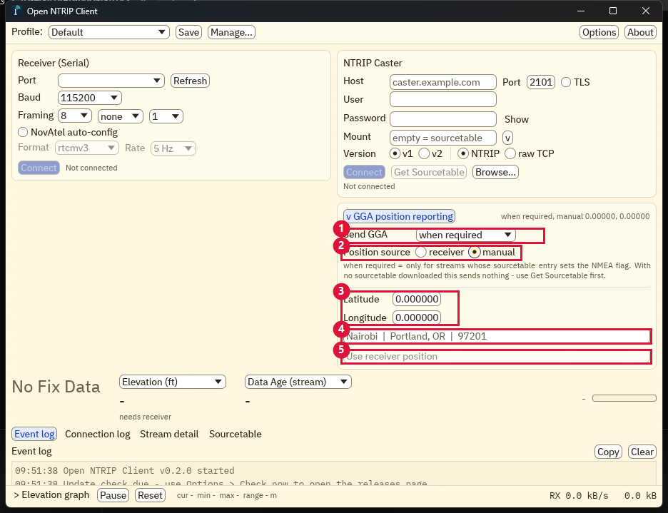
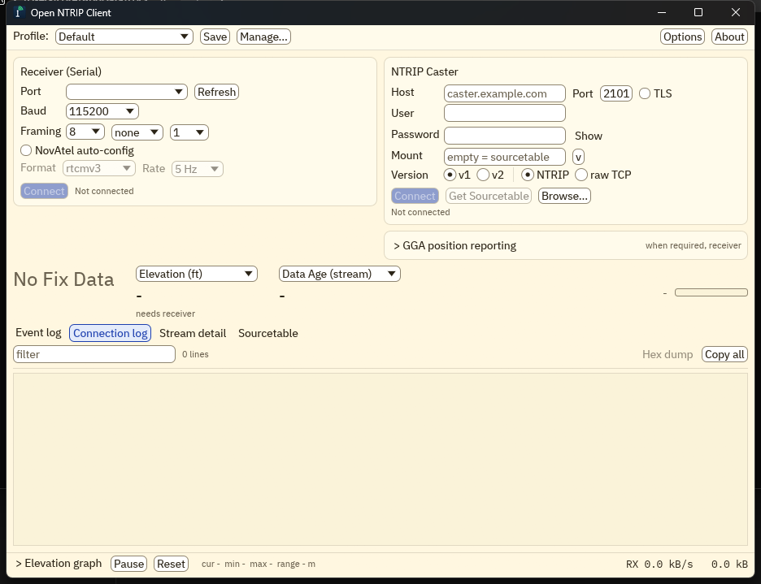
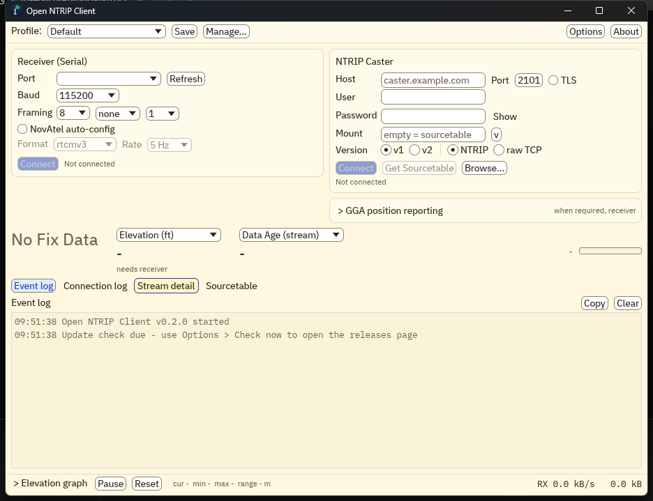
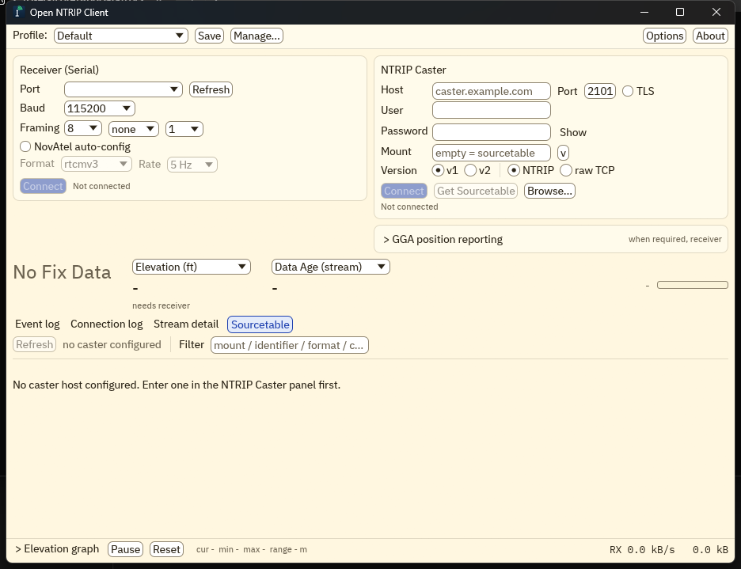

# Open NTRIP Client - user guide

Back to the [README](../README.md).

The whole client is a single window. This guide walks through every region of that
window, the GGA position handshake, the diagnostic tabs, the files the app writes, and
the headless self-test.

## The interface: a guided tour

The numbered regions below map to this screenshot:

| # | Region | What it does |
|---|--------|--------------|
| 1 | Profile and session bar | Switch/save connection profiles; open Options and About. |
| 2 | Receiver (Serial) | Connect a GNSS receiver on a COM port to forward corrections to it. |
| 3 | NTRIP Caster | Caster address, credentials, mountpoint, protocol; Connect. |
| 4 | GGA position reporting | Whether and how the client reports its position to the caster. |
| 5 | Live readouts and activity | Fix state, two configurable readouts, and the stream-activity bar. |
| 6 | Diagnostic tab bar | Event log / Connection log / Stream detail / Sourcetable. |
| 7 | Active tab content | The body of whichever tab is selected. |
| 8 | Elevation graph and RX total | Collapsible elevation chart plus the running byte rate/total. |

### 1. Profile and session bar

- **Profile** - a named preset of the whole caster configuration (host, port, credentials,
  mountpoint, protocol, TLS, GGA settings). Switch casters instantly; disabled while
  connected (disconnect first).
- **Save** - writes the current settings to `settings.toml`. The button reflects unsaved
  edits so you know when a change is only in memory.
- **Manage...** - add, clone, rename, and delete profiles.
- **Options** - logging, audio alert, auto-reconnect, update-check cadence, and the two
  configurable readout slots.
- **About** - version, credits, and the "check for updates" link.

### 2. Receiver (Serial)

Connect a GNSS receiver over a serial/COM port so the caster's corrections are forwarded to
it and its NMEA output drives the live readouts. This side is entirely optional - you can
diagnose a caster with no receiver attached.

- **Port** - the COM port dropdown lists each port with its device name and whether it is a
  USB or Bluetooth link (for example `COM5 - Bluetooth`), so you can tell a GNSS receiver
  from other serial devices. **Refresh** re-scans.
- **Baud** - 2400 to 115200.
- **Framing** - data bits, parity, and stop bits (all honored, unlike the original which
  ignored stop bits).
- **NovAtel auto-config** - when your receiver is a NovAtel, have the client send the
  configuration commands to start it emitting corrections in the chosen **Format** at the
  chosen **Rate**.
- **Connect** - opens the port. The status line beside it shows connection state and a serial
  overrun counter if the receiver outruns the link.

### 3. NTRIP Caster

The caster side of the connection.

- **Host** / **Port** - the caster address (default NTRIP port is 2101).
- **TLS** - encrypt the connection. Certificates verify against the bundled root store. (A
  loud, diagnostic-only "accept invalid certificates" override appears only while TLS is on -
  for reaching self-signed or bare-IP casters. Connecting with verification disabled shows an
  undismissable red banner.)
- **User** / **Password** - caster credentials. **Show** reveals the password while held.
- **Mount** - the mountpoint. Type it directly, use the **v** button to pick from the fetched
  sourcetable, or open the full **Sourcetable** tab with **Browse...**. Leave it empty and
  Connect to fetch the sourcetable itself.
- **Version** - NTRIP **v1** or **v2** (HTTP/1.1, chunked transfer), or **raw TCP** (no HTTP
  handshake - straight to the byte stream).
- **Connect** / **Disconnect** - start or stop the stream.
- **Get Sourcetable** - download the caster's list of mountpoints (populates the Sourcetable
  tab and the mount picker). Held in memory for the session; nothing is written to disk.
- **Browse...** - jump to the Sourcetable tab.

The status line reports the live state: `Connecting`, `Connected - waiting for data`,
`Streaming`, `Streaming - no data for N s` (a stall), `Reconnecting in 10 s (attempt N)`, or
the reason a stopped session ended.

### 4. GGA position reporting

Some casters (VRS and geofenced mounts) will not stream unless the client tells them where it
is, as an NMEA GGA sentence. This disclosure - collapsed by default, with a one-line summary
of its current setting - is where you configure that. Click the header to expand it:

1. **Send GGA** - the mode:
   - `off` - never send a position.
   - `when required` (the default) - send unless the sourcetable's entry for the mount says
     it takes no NMEA. Mounts the caster does not list - CHC APIS base serial numbers, for
     example - get a position too: APIS-style casters accept the connection and then hold
     the stream until a GGA arrives, so withholding one reads as a dead mount.
   - `always` - send regardless.
2. **Position source** - `receiver` passes your connected receiver's live GGA through
   verbatim; `manual` fabricates a GGA at the position you enter below.
3. **Latitude / Longitude** - the manual position, in decimal degrees (only shown for the
   `manual` source).
4. **City / ZIP search** - type a city (`Nairobi`, `Portland, OR`) or a US ZIP code
   (`97201`) and pick a result to fill the coordinates. Fully offline - a worldwide geocoder
   is embedded in the binary; no internet lookup.
5. **Use receiver position** - copy the connected receiver's current position into the manual
   fields.

The GGA sentence is sent about 0.3 s after connect, then every 10 s. If there is nothing to
send yet (receiver source with no fix, or a manual position still at its unset 0, 0 default),
the client retries every 2 s and explains the miss in the event log; the first position to
appear goes out promptly.

### 5. Live readouts and the activity bar

- **Fix state** (the large text) - `No Fix Data`, `No Fix`, `GPS`, `DGPS`, `RTK Float`, `RTK
  Fixed`, etc., colored by quality.
- **Two configurable slots** - pick what each shows from a dropdown: correction age,
  HDOP/VDOP/PDOP, satellite count, speed (raw or smoothed, mph or km/h), heading, elevation,
  base station id, and two stream-side values (**Data Age** and **Data Rate**) that work with
  no receiver attached. Defaults are chosen in Options.
- **Activity bar** (far right) - a bar that pulses green with each burst of corrections, so
  you can see data flowing at a glance. It carries a live kB/s caption and turns to an orange
  "no data N s" readout when a connected stream goes quiet (the pre-kick starvation window on
  GGA-hungry casters).

When corrections are flowing but no receiver is attached, the readouts that come from the
receiver read "needs receiver" so you know why they are blank.

### 6-7. The diagnostic tabs

The four surfaces that used to be separate floating windows are always-present tabs filling
the lower half of the window. Each is described below. The active tab is remembered between
runs.

**Event log** - the application's own running commentary: what it connected to, what it
decoded, what went wrong, and what to do about it. Trouble lines (errors, auth failures,
overruns) stand out. **Copy** and **Clear** act on the log.

**Connection log** - the verbatim protocol exchange, byte-for-byte: every request line the
client sends (`>`), every response line the caster returns (`<`), TLS results, and reconnect
decisions. A live **filter** narrows the view; **Hex dump** shows the raw bytes of the most
recent response the client could not classify (for example an HTML error page where RTCM was
expected). A small attention dot appears on this tab when such a response is captured.

**Stream detail** - a live RTCM3 inspector: a per-message-type table with counts, rates,
sizes, and ages; total-frame and **CRC failure** / **garbage byte** counters (the top "is
this actually RTCM3" signals); and the latest decoded diagnostics - base station position and
its baseline distance to you, antenna/receiver descriptors, caster text messages (1029), and
GLONASS bias presence (1230).

**Sourcetable** - a browsable, filterable, sortable view of the caster's sourcetable. Sub-tabs
for STR (streams), CAS (casters), and NET (networks) - including the CAS/NET records the
original client dropped - plus an Unparsed tab if the caster leaks non-standard lines. Click a
column to sort; double-click a stream (or select it and press **Use**) to set it as your
mountpoint.

Just above the tabs, once a stream is live and delivering frames, a **one-line stream
summary** appears: base station id and position, message-type and rate figures, and framing
health. Click it to jump straight to Stream detail.

### 8. Elevation graph and RX total

A collapsible strip at the very bottom. Expand **Elevation graph** for a live plot of the
receiver's elevation over time (with **Pause** / **Reset** and cur/min/max/range readouts).
On the right, always visible, is the running correction byte rate (**RX kB/s**) and session
total.

## Dialogs: Options, Profiles, About

Three things stayed as dialogs, because they are settings or information rather than live
session data:

- **Options** - default readout slots; the audio alert `.wav`; whether to write the event log
  (`Logs\`) and NMEA log (`NMEA\`); raw-corrections capture to `Captures\`; auto-reconnect;
  and how often to check for updates.
- **Profiles Manager** (**Manage...**) - add, clone, rename, delete connection profiles.
- **About** - version, credits (Lefebure, GeoNames, fonts), and a "check for updates" link
  that opens the releases page in your browser. (The original's binary self-updater is
  deliberately not reproduced - security.)

## Files the app writes

All next to the exe, only when the relevant feature is on:

| Path | Contents |
|------|----------|
| `settings.toml` | All settings and profiles (passwords in plaintext - see the security note). |
| `Logs\` | Daily event-log files (Options: "write event log"). |
| `NMEA\` | Daily NMEA capture from the receiver (Options: "write NMEA log"). |
| `Captures\*.rtcm` | Raw correction captures for offline analysis (Options: "capture corrections"). |
| `crash-pending.txt` + a crash report | Written only if a previous run crashed; announced once, then cleared. |

Sourcetables are **not** written to disk - they are held in memory and fetched fresh each
session (a cached table can only give a stale answer to "is this caster alive now").

## Headless self-test

`OpenNtripClient --selftest --host H --port P [--mount M --user U --pass P ...]` drives a full
caster connection with no GUI and exits non-zero on failure - for scripts and CI. Run
`--selftest` with no arguments for the full usage.
